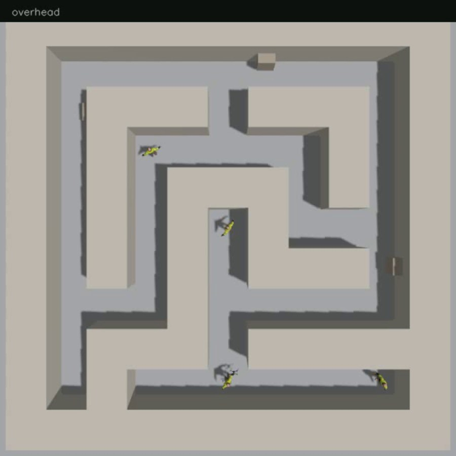
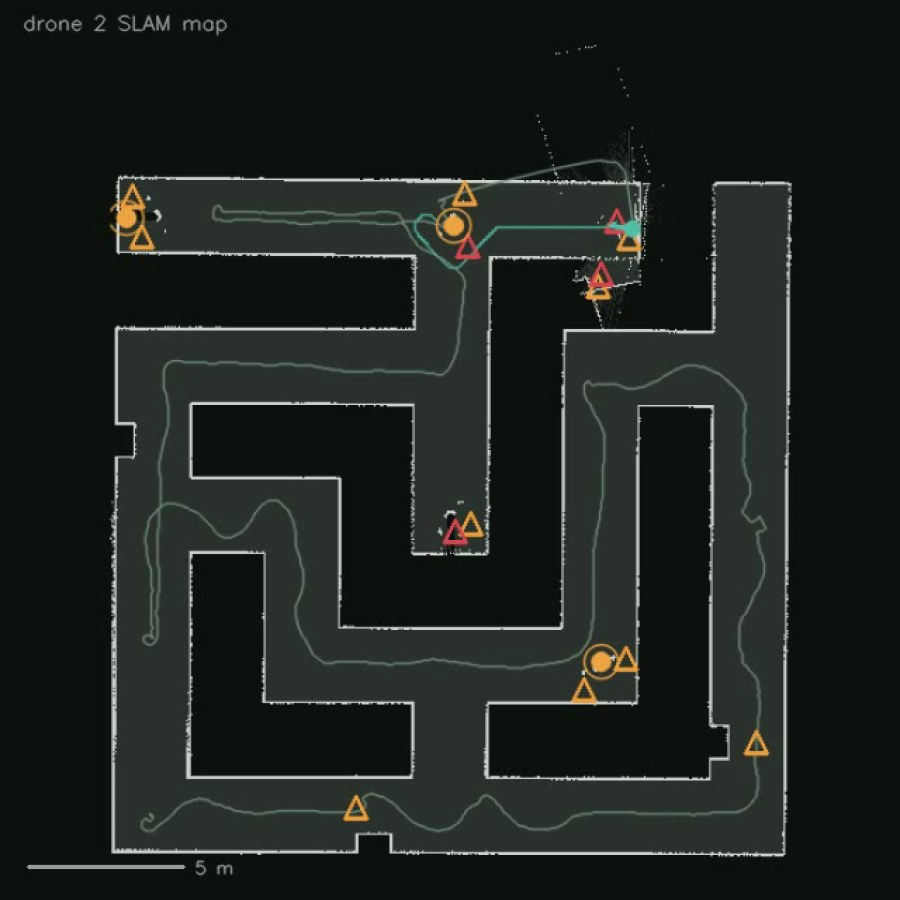

# SIH_Swarm — GPS-denied autonomous search and rescue

**Smart India Hackathon 2026 · Problem Statement SIH26177 · Team Swarm Robotics**

> *A deployable AI-powered autonomous drone that aids search-and-rescue operations by
> detecting people and hazards, thereby improving responder safety and reducing victim
> discovery time.*

A drone that enters a building nobody has mapped and nobody can safely walk into,
finds its own way around without GPS, and comes back with a floor plan, the
coordinates of the people inside, and the passages a responder should not use.

Two of them do it at once, without talking to each other — because inside a
collapsed structure the radio is the first thing to go.

**Everything here runs.** The numbers below were measured from recorded missions,
not estimated. The simulation is full-fidelity: ArduPilot's real firmware flying
real ROS 2 nodes against simulated sensors.

---

## What it does

| | |
|---|---|
| **Flies without GPS** | A 2D lidar scan-matches frame to frame. That odometry goes to the autopilot as a vision estimate, so its EKF flies on it exactly as it would on satellites. |
| **Maps as it goes** | SLAM builds a 5 cm occupancy grid, which is both the deliverable for the responder and the input to the search. |
| **Searches by itself** | The planner drives toward the boundary between mapped and unmapped space. No pilot, no waypoints, no prior map. It decides when the building is done, flies home and lands. |
| **Finds people** | An SSD-Lite detector runs on board. Depth at the bounding box gives range; the detection is projected into the map, confirmed across frames, and pinned as a coordinate. |
| **Finds hazards** | Passages narrowed by debris, and routes with no way through, are derived from the same map — no extra sensor, no second model. |
| **Splits the building** | Two drones claim opposite sectors before entry and a ground station merges their findings afterwards. Nothing passes between them in flight. |
| **Reports in lat/lon** | Survivors and hazards are geo-tagged against the same datum the autopilot uses as its EKF origin, so the coordinates mean something outside the robot. |
| **Ranks for dispatch** | A situation report orders casualties by whether the way in is obstructed, then by how confident the detection is, and a dashboard shows it on the map. |
| **Flies with or without GPS** | `--gps` swaps the EKF's position source to satellites. Nothing downstream changes: a drone that loses its fix on entering a structure keeps flying on the laser. |

---

## How it fits together

```
 Gazebo ──► ros_gz_bridge ──┬──► rf2o_laser_odometry ──► vio_to_ardupilot ──┐
  (lidar,       /scan       │      scan matching          MAVLink, udp 14550│
   RGB-D)    /camera/*      │      tf odom→base_link                        │
                            │                                               ▼
                            ├──► slam_toolbox ──► /map ──┐          ArduPilot SITL
                            │      tf map→odom           │           EKF3 on ext nav
                            │                            ▼                  ▲
                            │                    frontier_exploration ──────┘
                            │                      picks the frontier   ap/cmd_vel
                            │                      flies the search      over DDS
                            │                            ▲
                            │                            │ /person_map_pins
                            └──► person_detector ────────┤
                                   SSD-Lite on LiteRT    │ /hazard_markers
                                 hazard_mapper ──────────┘
                                   constrictions + blocked routes

        one graph per drone, isolated on its own ROS_DOMAIN_ID
                              │
                              ▼
                        ground_station
              joins both domains from outside the building,
              merges pins and hazards into one report
```

Two channels reach the autopilot at once: **MAVLink** carries the vision estimate
in, **ArduPilot's native DDS** carries arm, mode, takeoff and velocity commands
out. No MAVROS.

---

## Results

Measured from a recorded mission. Raw logs, the merged report and the video for
every run are kept under `swarm_ws/sim/logs/<timestamp>/`.

### One mission, both drones

| | |
|---|---|
| **Survivors found** | **3 of 4** — 4 raw detections merged to 3 unique |
| **Worst pin error** | **0.50 m** from ground truth |
| **Hazards mapped** | **13** — 9 narrowed passages, 4 routes with no way through |
| **Mission time** | ~607 s, both drones armed, searched, returned and landed unattended |
| **Operator commands in flight** | 0 |

| Survivor | Reported | Ground truth | Error | Seen by |
|---|---|---|---|---|
| S4 | (-4.71, 4.71) | (-4.8, 4.8) | **0.13 m** | drone 1 + drone 2 |
| S3 | (-0.09, -9.55) | (0.0, -9.6) | **0.10 m** | drone 2 |
| S1 | (10.10, -9.56) | (9.6, -9.6) | **0.50 m** | drone 2 |

The first survivor was found by **both** drones and reported once — the ground
station reconciles their maps into a single picture rather than counting the
same casualty twice.



*Overhead view of the world: the maze, the debris, four survivors and two drones.*



*What a responder receives — one drone's map of a building it had never seen, with
its flight path, survivor pins (circles) and hazards (triangles: amber for a
narrowed passage, red for a route with no way through).*

**The one it missed** is S2, standing in a dead end at the exact centre of the
building. Dead-end pockets expose the least unknown space, so the frontier
scoring ranks them last, and the survivor's own body reads as a narrowed passage
to the lidar — the drone flagged the spot as a hazard without ever confirming the
person. This is reproducible, understood, and on the list to fix.

### See it run

* **[docs/video/mission-demo.mp4](docs/video/mission-demo.mp4)** &mdash; the full
  mission, 3&times; speed. Six panels: the overhead view, both drones' cameras with
  the detector overlay, and both SLAM maps filling in with survivor pins and
  hazard markers as they are found.
* **[docs/index.html](docs/index.html)** &mdash; an interactive page with the plan
  view of the world (click a marker for its coordinates), the node graph, the
  endpoint table and the bringup steps. Open it in a browser, or serve the
  `docs/` folder with GitHub Pages.
* **[docs/dashboard.html](docs/dashboard.html)** &mdash; the command-centre view:
  every survivor geo-tagged and ranked for dispatch, the hazards that obstruct
  access, and the building as mapped. Built from the mission report, so it opens
  from disk with no server.
* **[docs/survivors.json](docs/survivors.json)** &mdash; the machine-readable
  report the ground station writes at the end of every mission, alongside a
  plain-text situation report.

The recording is made from the ROS graph itself, not by screen capture, so it
runs headless on any machine:

```bash
./sim/run_swarm.sh --record run.mp4
```

Raw logs, the merged report and the uncompressed video for every run are kept
under `swarm_ws/sim/logs/<timestamp>/`. Those are not committed &mdash; a single
mission recording is around 90 MB.

---

## Try it

Needs ROS 2 Jazzy, Gazebo Harmonic, a built ArduPilot SITL, ardupilot_gazebo,
`MicroXRCEAgent`, and `ardupilot_msgs` on the prefix path.

```bash
git clone <this repo> && cd SIH_Swarm
./setup.sh                              # checks tools, fetches rf2o, builds, generates the world

cd swarm_ws
./sim/run_swarm.sh                      # two drones, Gazebo GUI, full stack
./sim/run_swarm.sh --headless           # no GUI
./sim/run_swarm.sh --record run.mp4     # film the mission from the ROS graph
./sim/stop_swarm.sh                     # stop everything
```

Watch it live in RViz on either drone's domain:

```bash
ROS_DOMAIN_ID=1 rviz2     # /map, /scan, /person_map_pins, /hazard_markers
```

`setup.sh` reports exactly what is missing rather than failing part-way, and warns
about the one environment trap worth knowing: installing the detector's runtime
pulls in NumPy 2, which the distro OpenCV and `cv_bridge` are not built against.

---

## Layout

```
swarm_ws/src/
  drone_control/       frontier search, hazard mapping, ground station, teleop
  drone_mapping/       lidar odometry plumbing, vision bridge to ArduPilot, URDF
  ssd_lite_ros/        SSD-Lite person detector on RGB-D
  gps_denied.parm      the autopilot parameters that switch GPS off

swarm_ws/sim/
  tools/gen_world.py          generates the maze, proves it is fully reachable
  tools/gen_drone_models.py   splices sensors onto the ArduPilot airframe
  tools/record_mission.py     films a run from ROS topics - no screen capture
  worlds/                     the generated world
  config/                     per-drone MAVLink and DDS parameters
  run_swarm.sh                brings the whole thing up
  stop_swarm.sh               takes it down
  README.md                   the simulation in detail
```

The world is **generated, not drawn**: a seeded maze with loops cut through it,
flood-filled to prove every square is reachable before it is written, survivors
placed automatically at the dead ends furthest from both launch points, and
debris that narrows corridors without sealing them.

---

## Endpoints

Everything derives from the SITL instance index, so a third drone is instance 2
and the next slot in each column.

| Channel | Drone 1 | Drone 2 |
|---|---|---|
| `ROS_DOMAIN_ID` | 1 | 2 |
| SITL instance | 0 | 1 |
| Gazebo FDM | 9002 | 9012 |
| MAVLink, vision estimate | 14550 | 14560 |
| MAVLink, spare for a GCS | 14551 | 14561 |
| Micro-XRCE-DDS agent | 2019 | 2020 |

---

## Honest status

**Built and measured:** GPS-denied flight, SLAM mapping, autonomous frontier
search, on-board person detection with map-frame pins, hazard mapping, sector
partitioning across two drones, and merged reporting.

**Not built:** thermal and gas sensing (needs hardware the airframe does not
carry), and any hardware flight — this is simulation. What transfers is that the
ROS 2 graph, the topics and the autopilot firmware are the same ones a real
airframe would run; nothing in the software is simulation-specific.

**Not swarming, deliberately.** This is static task partitioning with an offline
merge: the drones divide the building before entry and reconcile after exit. Real
swarming — emergent allocation, robustness to losing an agent, scaling in N —
would need frontier auctions over a modelled radio link, which is the next step
rather than a claim made here.

**Known gaps, found by testing rather than inspection:**

* **The sector partition stops holding about a minute in.** The fall-back to
  searching the whole building latches the first time no frontier happens to sit
  inside a drone's wedge, which occurs while the map is still small. From then on
  both drones search everywhere. Making the fall-back reversible was tried and
  made it worse (see below).
* **The drones have no mutual awareness and can collide.** With both outside
  their sectors they converged on the same corridor and hit each other; both
  crash-landed 2.8 m apart. Nothing in the planner knows a peer exists — they
  read each other only as anonymous lidar returns. Peer avoidance is the
  prerequisite for any further coordination work.
* **A survivor standing in a corridor reads as a narrowed passage.** The lidar
  sees a body-sized obstacle and the hazard mapper calls it a constriction. It is
  arguably useful — an unexplained obstruction is worth investigating — but it is
  currently reported as a hazard rather than a lead.

---

## Licence

Apache-2.0. See `LICENSE`.

`rf2o_laser_odometry` is fetched by `setup.sh` rather than vendored, and the drone
models are generated at setup time from `ardupilot_gazebo` (LGPL-3.0) so that no
third-party licensed content is committed to this repository.
